# Numeric Methods for Solving Partial Differential Equations Applied to the Wave Equation

**Numerical Analysis**

**Computer and Systems Department**

**Ingeniery school**

## Contents:

- [Members](#Members)
- [implemented technologies](#Implemented-technologies)
	- Python v7
	- SciPy ecosystem
- [Methods for the numerical solution of the wave equation](#Methods-for-the-numerical-solution-of-the-wave-equation)
	- [Finite Differences Method](#Finite-Differences-Method)
	- [Fourier Method](#Fourier-Method)
	- [Finite Elements Method](#Finite-Elements-Method)

## Members

**Teacher manager**
- Edwar Samir Posada Murillo

**Student researchers**
- Brian F. Morales A. - Mathematical Engineering
- Jose A. Carvajal B. - Mathematical Engineering
- José O. Rengifo C. - Systems Engineering
- Nicolás Restrepo L. - mathematical Engineering
- Nicholas Rose

## Methods for the numerical solution of the wave equation

### Finite Differences Method

To approximate the solution to the wave equation

subject to the boundary conditions

and the initial conditions

#### Examples 

1. 
	- Approximate the solution to the wave equation.
	
	
	- Boundary conditions.
	
	

	- Initial conditions.
	
	

	-	Running the code
	
	
	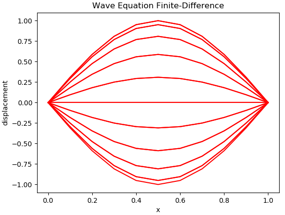

2. 
	- Approximate the solution to the wave equation.
	
	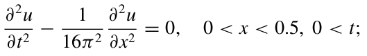

	-  Boundary conditions.
	
	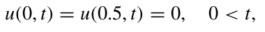
	
	- Initial conditions.
	
	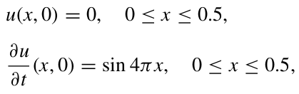

	- Running the code
	
	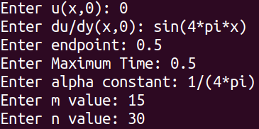
	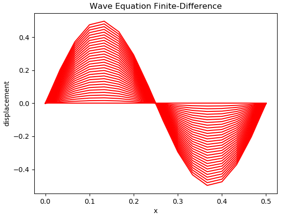

3. 
	- Approximate the solution to the wave equation.
	
	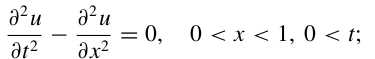

	-  Boundary conditions.
	
	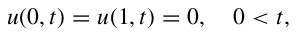
	
	- Initial conditions.
	
	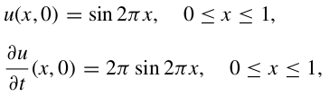
	
	- Running the code
	
	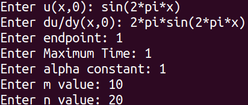
	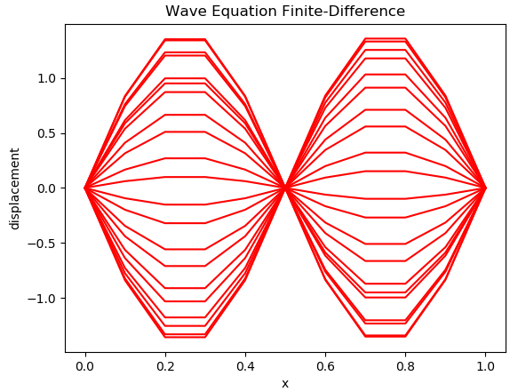
4. 
	- Approximate the solution to the wave equation.
	
	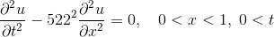
	
	- Boundary conditions.
	
	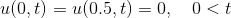
	
	- Initial conditions.
	
	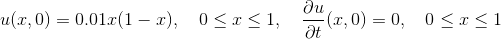
	
	- Running the code.
	
	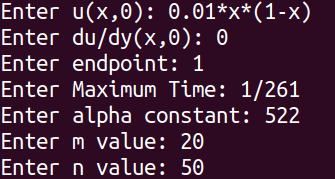
	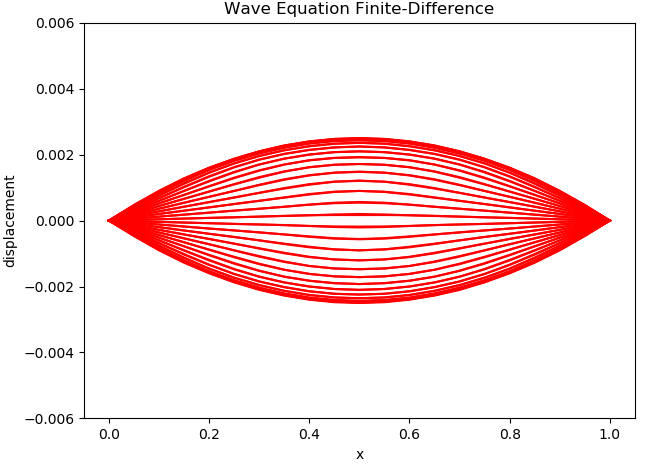

5.  
	- Approximate the solution to the wave equation.
	
	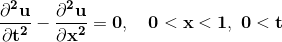

	- Boundary conditions.
	
	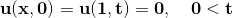
	
	- Initial conditions.
	
	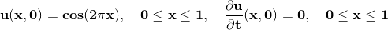
	
	- Running the code.
	
	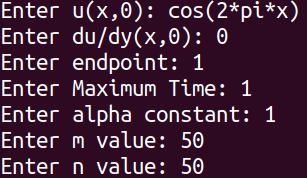
	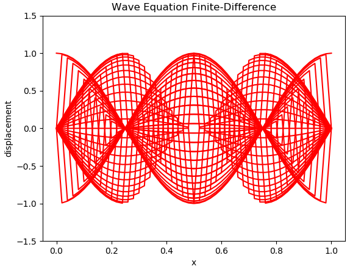

### Fourier Method

### Finite Elements Method 

## Implemented technologies

- Python v7 [Download]( https://www.python.org/downloads/release/python-370/ "Python v7")

- SciPy ecosystem [CORE PACKAGES]( https://scipy.org/install.html "SciPy") 
  - Numpy
  - SciPy library
  - Matplotlib
  - IPython
  - Sympy - [Symbolic Mathematics in Python]( https://www.scipy-lectures.org/advanced/sympy.html "Chapters")
  - Pandas

<!--stackedit_data:
eyJoaXN0b3J5IjpbMTA0ODA4MjAxMywtODg1MjE3OTg4LC0xND
M4OTIxOTc0LDk0Njk0NjQwNSwtMTI5MzQ2NDYzNiwxMTgzOTUx
NjM2LDcxNjU4MDc3NSw5NzcyMTgwNTQsLTEwNTEwODQ2MjIsLT
I2NzY5MDkwOCwtODAwNjQ3MDQ2LC0yMDI2MDk1NzY3LC0xMDA3
NDc4MDQwLC02MzY4ODIxNjEsMjcwNTUwMDc1LC0xMzQ4ODYzOT
QzLC0xNjQzMjA4MDEyLDg2ODIxNzM3MCwtODc3NTMwOTk2XX0=

-->