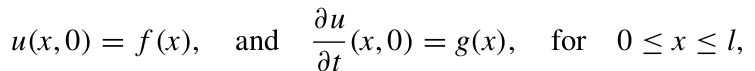

# Numeric Methods for Solving Partial Differential Equations Applied to the Wave Equation

**Numerical Analysis**

**Computer and Systems Department**

**Ingeniery school**

## Contents:

- [Members](#Members)
- [implemented technologies](#Implemented-technologies)
	- Python v7
	- SciPy ecosystem
- [Methods for the numerical solution of the wave equation](#Methods-for-the-numerical-solution-of-the-wave-equation)
	- [Finite Differences Method](#Finite-Differences-Method)
	- [Fourier Method](#Fourier-Method)
	- [Finite Elements Method](#Finite-Elements-Method)

## Members

**Teacher manager**
- Edwar Samir Posada Murillo

**Student researchers**
- Brian F. Morales A.
- Jose A. Carvajal B.
- José O. Rengifo C.
- Nicolás Restrepo L.
- Nicholas Rose

## Methods for the numerical solution of the wave equation

### Finite Differences Method

To approximate the solution to the wave equation

subject to the boundary conditions

and the initial conditions

#### Examples 

1. 
	- 
	-  
	- 
2. 
	- 
	-  
	- 
3. 
	- 
	-  
	- 
4.
6.  
7.  

### Fourier Method

### Finite Elements Method 

## Implemented technologies

- Python v7 [Download]( https://www.python.org/downloads/release/python-370/ "Python v7")

- SciPy ecosystem [CORE PACKAGES]( https://scipy.org/install.html "SciPy") 
  - Numpy
  - SciPy library
  - Matplotlib
  - IPython
  - Sympy - [Symbolic Mathematics in Python]( https://www.scipy-lectures.org/advanced/sympy.html "Chapters")
  - Pandas

<!--stackedit_data:
eyJoaXN0b3J5IjpbLTE4OTI1NTgyMjcsMjcwNTUwMDc1LC0xMz
Q4ODYzOTQzLC0xNjQzMjA4MDEyLDg2ODIxNzM3MCwtODc3NTMw
OTk2XX0=
-->